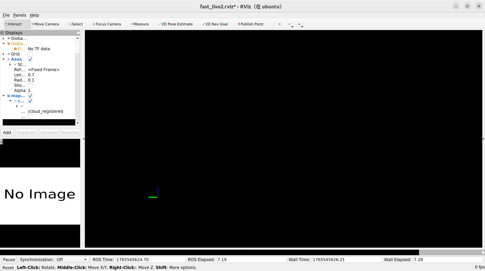

這是一份從零開始的完整操作 SOP。假設您的 AGX Orin 剛剛開機，且您現在位於 Ubuntu 電腦前使用 Terminator 準備連線。

這份指南包含了 **「啟動容器」**、**「恢復環境（因為 Docker 預設不保存系統安裝的軟體）」** 以及 **「執行 Fast-LIVO2 與播放數據」**。

-----

### 第一階段：連線與主機準備 (在您的 Ubuntu 電腦上)

1.  **開啟 Terminator**。
2.  **SSH 連線 (關鍵步驟)**：
    務必加上 `-X` 參數，這是讓 RViz 畫面能傳回來的關鍵。
    ```bash
    # 請替換成您 Jetson 的實際 IP
    ssh -X robot@<Jetson_IP>
    ```
3.  **檢查顯示變數** (連進去後執行)：
    ```bash
    echo $DISPLAY
    # 必須看到類似 localhost:10.0 的輸出。如果是空白，請嘗試重新連線用 -Y
    ```
4.  **開放 Docker 顯示權限** (在 Jetson 主機執行)：
    ```bash
    xhost +local:docker
    ```

-----

### 第二階段：啟動 Docker 容器

您「關機」容器後，安裝好的 RViz 不會消失，下次可以直接 `docker start` 回來。

**在 Jetson 主機執行：**

```bash
# 啟動容器
docker run -it \
    --net=host \
    --runtime=nvidia \
    --privileged \
    -e DISPLAY=$DISPLAY \
    -e QT_X11_NO_MITSHM=1 \
    -v /tmp/.X11-unix:/tmp/.X11-unix \
    -v ~/.Xauthority:/root/.Xauthority \
    -v ~/fastlivo2_ws:/root/catkin_ws \
    -v /dev:/dev \
    --name fastlivo_run \
    ros:noetic-ros-base /bin/bash
```

-----

### 第三階段：執行 Fast-LIVO2 (主程式)

現在環境已經準備好，可以啟動了。

### 記得在一個終端機內運行roscore!

**在容器內執行：**

```bash
# 啟動 Fast-LIVO2 (Avia 版本)
# 這會自動帶起 RViz
roslaunch fast_livo mapping_avia.launch
```

*此時您的螢幕應該會跳出 RViz 視窗。*

-----

### 第四階段：播放數據 (模擬雷達輸入)

現在程式在跑了，但沒有數據。我們需要開第二個視窗來播放 Rosbag。

1.  **在您的 Ubuntu 電腦**，打開 Terminator 的第二個分割視窗 (Ctrl+Shift+E 或 O)。
2.  **SSH 連線** (一樣要 `-X`，雖然這個視窗不用顯示，但保持習慣)：
    ```bash
    ssh -X robot@<Jetson_IP>
    ```
3.  **進入同一個容器**：
    ```bash
    docker exec -it fastlivo_run /bin/bash
    ```
4.  **播放數據**：
    ```bash
    # 載入環境 (如果你剛加到 .bashrc 了這行可省，但保險起見)
    source /root/catkin_ws/devel/setup.bash

    # 進入放 bag 的位置 (假設您之前下載在 bag 資料夾)
    cd /root/catkin_ws/bag

    # 播放
    rosbag play hku_main_building.bag
    ```

-----

### 🎉 成功畫面


  * **視窗 1 (Roslaunch):** 會瘋狂跳動綠色的 `[INFO]` 訊息，顯示目前的位姿和速度。
  * **視窗 2 (Rosbag):** 顯示播放進度條。
  * **RViz 視窗:** 應該會看到彩色的點雲地圖正在即時構建。

-----

### 📌 下次重開機後怎麼回來？

因為這次啟動移除了 `--rm`，下次您重開 Jetson 後，只需要：

1.  `ssh -X ...`
2.  `xhost +local:docker`
3.  `docker start -ai fastlivo_run` (直接喚醒舊容器，**不用**再跑安裝指令！)
4.  `roslaunch ...`

---

### 選做：恢復執行環境 (第一次進入容器)

因為這是基礎映像檔，每次建立新容器時，系統層級的軟體 (RViz, 驅動依賴) 會是初始狀態。請執行這一次性的修復：

**在容器內 (`root@ubuntu:/#`) 執行：**

```bash
# 1. 更新並安裝 RViz 和必要庫 (這步最久，約 3-5 分鐘)
apt-get update
apt-get install -y ros-noetic-desktop libpcl-dev libpcap-dev libffi-dev

# 2. 修復 libffi 連結錯誤 (解決 roslaunch 崩潰問題)
ln -sf /usr/lib/aarch64-linux-gnu/libffi.so.7 /usr/lib/aarch64-linux-gnu/libffi.so.8
ldconfig

# 3. 永久加入環境變數 (這樣下次登入不用再打 source)
echo "source /opt/ros/noetic/setup.bash" >> ~/.bashrc
echo "source /root/catkin_ws/devel/setup.bash" >> ~/.bashrc
source ~/.bashrc
```
