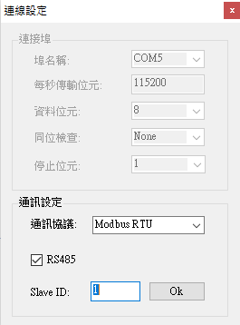
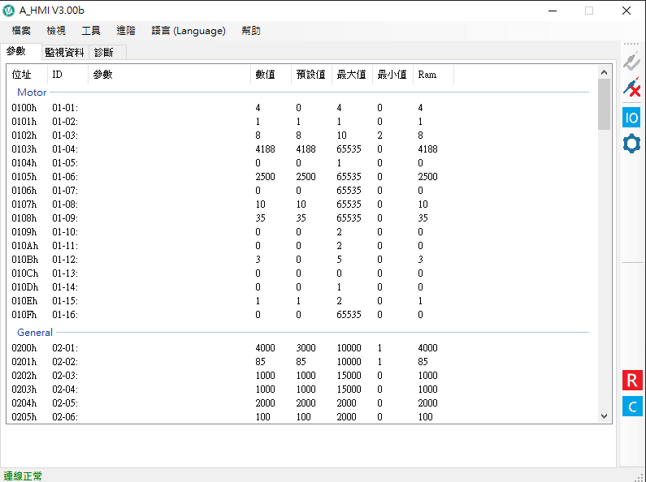

# 無刷馬達驅動器 (DEV-104) 通訊介面測試與除錯紀錄

**日期**：2025/01/01

**測試對象**：Motion Tech DEV(104) 雙通道 BLDC 驅動器

**測試目標**：建立 PC 端與驅動器之 RS485 通訊，以利後續參數監控與 PID 系統鑑別。

### 一、 硬體配置與準備

1. **接線製作**：完成驅動器 CN5/CN6 通訊埠之 RJ45 轉接頭端子壓接。
2. **供電測試**：接入 24V (19.7V) 電源，確認驅動器 PWR 燈號恆亮，ALM 燈號因 STO 未接呈現快速閃爍（屬正常待機狀態）。
3. **通訊介面**：使用 USB 轉 RS485 轉換器（晶片方案：PL2303HXA）。

### 二、 遇到的問題與排除過程 (Troubleshooting)

#### **狀況 1：電腦無法識別 USB 轉換器**

* **現象**：裝置管理員顯示黃色驚嘆號，錯誤訊息提示晶片已停產或不支援 (Code 10)。
* **原因分析**：Windows 自動更新之驅動程式版本過新，封鎖舊版 PL2303HXA 晶片。
* **解決方案**：
* 手動下載並降級驅動程式至 **2011年版本**。
* **結果**：裝置管理員成功識別裝置，分配埠號為 **COM5**。

#### **狀況 2：通訊軟體連線逾時 (Connection Timeout)**

* **現象**：開啟 Modbus Poll 軟體連線，發送指令後無回應，顯示 Timeout Error。
* **除錯步驟**：
1. **軟體參數修正**：
* 修正通訊協定：由 Modbus ASCII 改為 **Modbus RTU** (工業標準)。
* 調整鮑率 (Baud Rate)：修正為 **115200 bps** (對應驅動器預設值)。
* 確認站號 (Slave ID)：設定為 **1** (對應 SW2 指撥開關全 OFF 設定)。

2. **硬體線路修正**：
* 雖參數已修正仍無法連線，懷疑 RS485 差動訊號極性接反。
* **對策**：將 USB 轉換器端子上的 **A+ 與 A- (或 D+/D-) 線路對調**。

* **最終結果**：對調後立即恢復正常通訊，軟體顯示 "OK"，且驅動器 STA 燈號開始閃爍 (表示資料傳輸中)。

### 三、 最終成功通訊參數 (Configuration)

### 四、 測試成果

1. **通訊建立**：PC 端軟體可正確讀取驅動器暫存器數值。
2. **驗證照片**：

* *附圖：成功讀取數據與連線 OK 畫面*

### 五、 下一步計畫 (Next Steps)

1. 透過 RS485 讀取編碼器回授數值 (Encoder Feedback)，驗證數據正確性。
2. 進行開迴路 (Open-Loop) 步階響應測試，採集速度曲線以計算馬達轉移函數。

