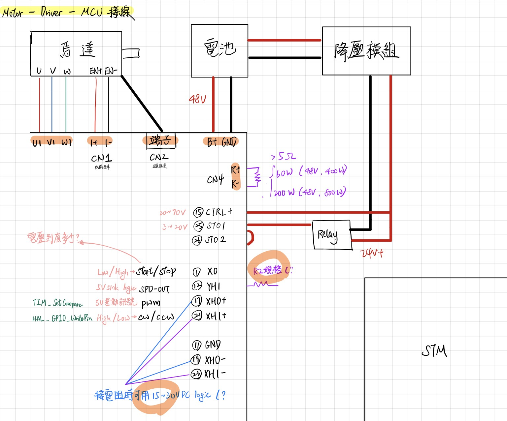

今天整理了一下驅動器的接線脈絡:

### 一、 複習：每個腳位收到訊號會做什麼？

1. **XH0+ (PWM 速度指令)**
* **訊號類型**：PWM 脈衝波（頻率建議 20kHz）。
* **收到訊號時**：
* **Duty (佔空比) 變大**  馬達加速。
* **Duty 變小**  馬達減速。
* **Duty = 0%**  馬達停止。

2. **XH1+ (Direction 方向指令)**
* **訊號類型**：GPIO 高低電位 (High/Low)。
* **收到訊號時**：
* **High (3.3V)**  馬達正轉 (CW)。
* **Low (0V)**  馬達反轉 (CCW)。

3. **X0 (Enable 啟動開關)**
* **訊號類型**：SINK 輸入 (拉低導通)。
* **收到訊號時**：
* **Low (0V/接地)**  **馬達通電 (Servo ON)**，開始聽 PWM 指令。
* **High (3.3V/懸空)**  **馬達放鬆 (Servo OFF)**，就像切到 N 檔，PWM 給再大都不會理你。

4. **YH1 (Speed Feedback 速度回授)**
* **訊號類型**：方波脈衝 (Open Collector)。
* **發生什麼事**：馬達轉越快，這個腳位吐出來的方波頻率就越高。

---

### 二、 「Y系列腳位」對照表

Y0_N,Pin 4,M1 警報負極,要接 (如果你想偵測 M1 故障),接 STM32 GND
Y0_P,Pin 2,M1 警報正極,要接,接 STM32 GPIO Input (開上拉)
Y1_N,Pin 8,M2 警報負極,不用接,懸空
Y1_P,Pin 6,M2 警報正極,不用接,懸空
YH1,Pin 12,M1 速度回授,一定要接！,接 STM32 Timer Input (PA0)

---
### 三、 NUCLEO-F446RE 接線地圖 (推薦接法)

為了讓你寫程式方便（使用標準的 Arduino Header 腳位定義），建議依照下表連接。這些腳位都經過挑選，避開了系統衝突：

| 驅動器功能 | 驅動器腳位 | NUCLEO 腳位 | STM32 內部資源 | 程式設定建議 |
| --- | --- | --- | --- | --- |
| **速度 (PWM)** | **XH0+** (Pin 17) | **D7** (PA8) | **TIM1_CH1** | 設定為 `PWM Generation CH1`。 |
| **方向 (Dir)** | **XH1+** (Pin 21) | **D4** (PB5) | **GPIO Output** | 隨便一個 GPIO 都可以。 |
| **啟動 (Enable)** | **X0** (Pin 1) | **D3** (PB3) | **GPIO Output** | 隨便一個 GPIO 都可以。 |
| **回授 (Speed)** | **YH1** (Pin 12) | **A0** (PA0) | **TIM2_CH1** | 設定為 `Input Capture direct mode`。 

 **務必開啟 Internal Pull-up**。 |
| **訊號地** | **XH0-, XH1-, GND** | **GND** | N/A | 板子上任何一個 GND 都可以。 |

**[特別提醒]**
你的 **STO (Pin 25, 26)** 依然要接到外部的 **24V DC-DC**，**千萬不要** 接到 NUCLEO 板子上的 5V 或 3.3V，推不動的。

**為什麼選 PA0 (A0) 做回授？**
因為 PA0 連接的是 **TIM2**，這是 STM32F446 裡面的 **32-bit 計時器**。當馬達轉速很高、脈衝數累積很快時，32-bit 計時器比較不會「溢位 (Overflow)」，會讓你寫程式計算轉速時輕鬆非常多！

---

[STM32 PWM with Input Capture Guide](https://www.youtube.com/watch?v=IZ_FueBlbmQ)
這個影片展示了如何在 STM32 上同時使用 PWM 和 Input Capture 功能，雖然型號可能略有不同，但原理與你的 F446RE 是一模一樣的，非常適合參考。

---

### 測試建議

### 一、 致命風險警告：電源供應器 vs. 反電動勢 (Back EMF)

這點最重要，請畫三顆星星。⭐⭐⭐
電池可以「充電」也可以「放電」，但**一般的電源供應器只能「輸出」電流，不能「吸收」電流**。

* **危險場景**：當你的 800W 馬達正在轉，你突然下令 `Stop` 或 `減速`。
* **物理現象**：馬達瞬間變成「發電機」，巨大的能量會灌回驅動器。因為電源供應器無法吸收這股能量，**直流母線電壓 (DC Bus Voltage) 會瞬間飆高**（例如從 48V 衝到 60V, 70V...）。
* **後果**：
1. 觸發電源供應器的 OVP (過壓保護)  斷電。
2. **更慘的情況**：電壓突波擊穿電源供應器的輸出電容，**把電源供應器燒壞**。

**[今日測試的必要防護]**

1. **加上假負載 (Dummy Load)**：這是老鳥的作法。在電源供應器的輸出端並聯一顆**大功率電阻**（例如稍微耗掉 0.5A~1A 的電流）或一顆 24V/48V 的燈泡。這可以幫助消耗掉一點反向灌回來的電流。
2. **設定長一點的減速時間 (Deceleration Time)**：
* 透過 RS485 修改驅動器參數。
* 把 `Deceleration Time` 設長一點（例如 1000ms 或更長）。
* **絕對不要**在電源供應器模式下測試「急停」或「正反轉瞬間切換」。

---

### 二、 參數設定：馬達極數 (Pole Pairs)

在 STM32 送 PWM 之前，你必須先用 RS485 和電腦確認這件事。
驅動器需要知道馬達的構造才能正確換相。如果設錯，馬達可能轉速顯示錯誤，或者轉起來很不順（電流很大但無力）。

* **必要動作**：
1. 查馬達規格書，找出 **極數 (Poles)** 或 **極對數 (Pole Pairs)**。
* 注意：有些手冊寫 Pole (例如 8 極)，有些寫 Pair (4 對)。通常驅動器參數是問 "Poles" (填 8)。

2. 透過電腦軟體讀取驅動器參數，確認設定值與馬達相符。

---

### 三、 霍爾傳感器 (Hall Sensor) 的相序確認

你有 U/V/W 動力線，也有 U/V/W 的霍爾訊號線。這兩組線必須**嚴格對應**。

* **如果不對應會怎樣？** 馬達會發出怪聲、抖動、電流暴增，或者完全不動。
* **測試SOP (微電流測試法)**：
1. 將電源供應器的**電流限制 (Current Limit)** 設低一點（例如 **2A~3A**）。
2. 給一個很小的 PWM (讓馬達極慢速轉動)。
3. **觀察**：
* 正常：馬達平滑轉動，電源供應器電流很小且穩定。
* 異常：馬達卡卡的、發出「嘎嘎」聲，或者電源供應器直接跳到定電流 (CC) 模式（代表短路或相序錯）。

4. **修正**：如果異常，立刻斷電。檢查 U/V/W 順序是否接反。

---

### 四、 STM32 的「共地」再次確認

雖然很囉嗦，但我必須再提一次。

* 電源供應器的負極 (-)。
* 驅動器的 GND (Pin 11)。
* **STM32 開發板的 GND**。
* (如果有) DC-DC 的輸出負極。

這四個點必須**物理上接在一起**。如果 STM32 的地懸空，PWM 訊號會浮動，馬達可能會自己亂暴衝。

---

### 五、 今天的測試流程建議 (Checklist)

1. **空載測試**：先把馬達從車子或負載上拆下來，讓軸心懸空空轉。
2. **電流設限**：電源供應器電壓設 **24V** (先不用 48V，24V 比較溫柔)，電流限 **3A**。
3. **通訊確認**：電腦看得到驅動器，沒有 Error。
4. **手動轉軸**：用手轉一下馬達軸，看電腦軟體上有沒有讀到轉速/位置變化？（確認編碼器/霍爾正常）。
5. **上電 (Servo ON)**：拉低 X0 (Enable)，看馬達是否有「鎖住」的力道（或是變緊）。
6. **微速旋轉**：STM32 送出 10% PWM。
7. **觀察與收工**：確認方向正確、運轉平順、沒有怪味。

