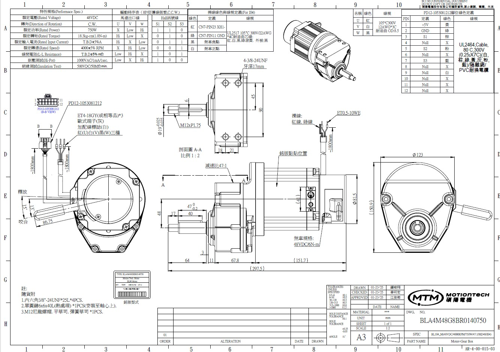
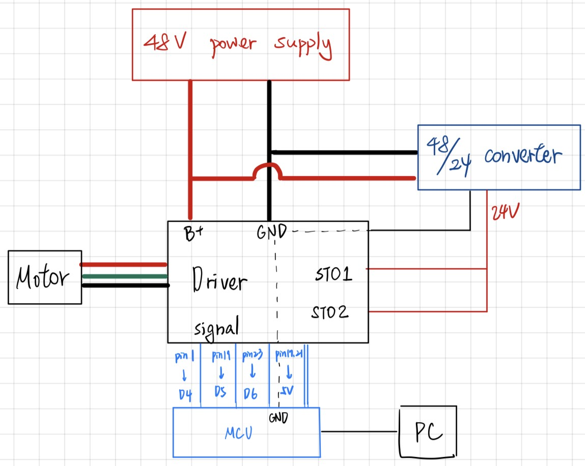

### 48V BLDC 馬達驅動與 Arduino 控制整合

**日期**：2026/01/07
**項目**：三代車動力系統開發
**硬體**：Arduino Nano, DEV(104) 驅動器, 48V 750W BLDC 馬達

#### 1. 初始設置與安全檢查

* **機械煞車確認**：確認馬達外部手煞車拉桿需處於鬆開狀態（手轉軸心可動），避免通電後堵轉 (Stall) 造成硬體損壞。
  
可參考工程圖(下圖):

* **電源供應器設定**：
* 電壓 48V / 限流 10A，過低的電流或功率可能導致驅動器亮低壓警報。
* 確認 B+ 與 Pin 15 (Control Power) 不可以同時供電!

#### 2. 驅動器參數調校 (軟體層面)

* **現象**：馬達可轉動，但無法透過 Arduino 控制速度與方向（維持定速）。
* **參數修正**：透過 RS485 修改驅動器內部暫存器：
* `01-12 (OP Mode)` 確認設為 **3 (PWM Duty Mode)**：啟用 PWM 訊號輸入。
* `06-06 (XH1 Function)` 確認設為 **102 (CW/CCW)**：啟用 Pin 21 作為方向控制。
* `02-09 (Analog Input Range)` 由 `0` 改為 **1 (0-10V)**：修正 Arduino 5V PWM 被誤判為全速的問題，匹配線性度。

#### 3. 關鍵突破：差動訊號轉單端控制 (硬體層面)

* **卡關點**：驅動器 XH 埠為差動輸入 (Differential Input)，Arduino 僅有單端輸出 (Single-Ended)，導致訊號無法被正確讀取。
* **嘗試**：最初嘗試將 XH- 接地，XH+ 接訊號，無法控制。
* **最終解決方案 (Sinking 接法)**：
* 參考手冊 3.4 接線圖，採用 **共陽極 (Common Anode) / Low Active** 接法。
* **固定端**：將驅動器 **XH0+ (Pin 17)** 與 **XH1+ (Pin 21)** 接至 **Arduino 5V** (利用驅動器內部 5V 邏輯電阻)。
* **控制端**：將驅動器 **XH0- (Pin 19)** 與 **XH1- (Pin 23)** 接至 **Arduino I/O (D5, D6)**。

#### 4. 程式邏輯反轉 (韌體層面)

* 因改用 Sinking 接法，控制邏輯變更為 **低電位觸發 (Low Active)**：
* **方向**：`LOW` = 導通 (Action A), `HIGH` = 不導通 (Action B)。
* **速度**：PWM `255` = 停止 (0%), PWM `0` = 全速 (100%)。
* **接線圖:**

* **測試結果**：成功實現平滑加減速 (Ramping) 與正反轉切換。

---

### ✅ 最終結論

成功建立 Arduino 與工業級驅動器的通訊介面。確認在**不需外部轉換晶片**的情況下，透過 **「XH+ 接 5V、XH- 接 I/O、程式邏輯反向」** 的方式，可完美控制差動輸入型的驅動器。
